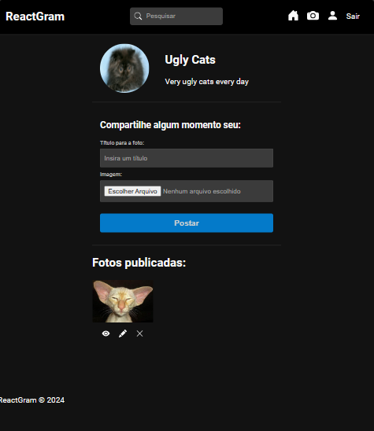

# ReactGram

.png>)

---

<strong>
ReactGram is a fullstack Instagram clone made with React and Express.
</strong>
    
    
    
    
    
<br />
<br />
<br />


# Features

- Create and update profile
- Post and edit photos
- Comment in photos
- Like photos

# Installation
Follow the steps bellow to install:
```git
1. Clone the repository
2. Navigate to .\fronted\
3. Run 'npm i'
4. Navigate to .\backend\
5. Run 'npm i'
6. Create a .env file
7. define the .env
```
<strong>.env example:</strong>
```env
PORT=APP_PORT
DB_USER=DATABASE_USERNAME
DB_PASS=YOUR_PASSWORD
JWT_SECRET=YOUR_SECRET
```

# Contributing
### Fork and clone your repository

1. Fork the repository
2. Clone your forked code `git clone https://github.com/KaiD3v/ReactGram.git`
3. Create a new branch
4. Push your commits
5. Submit a new Pull Request

---
